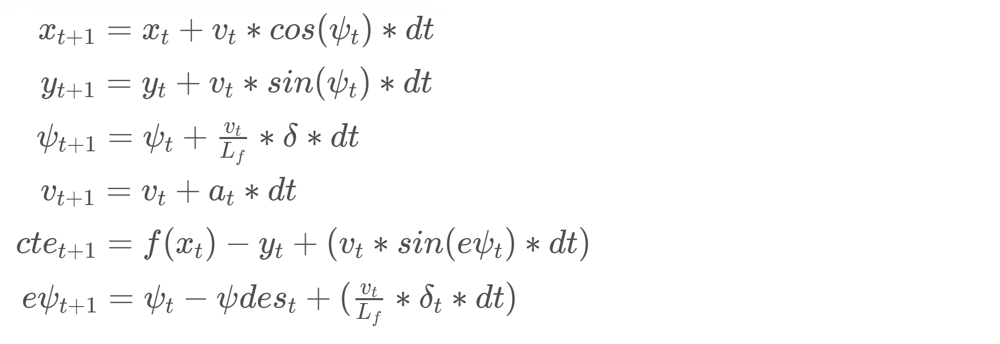
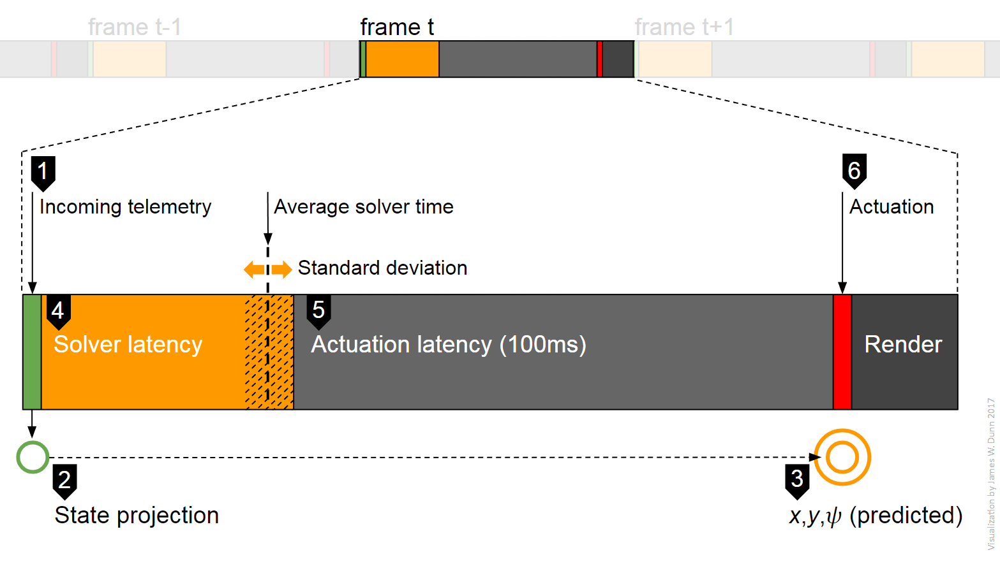
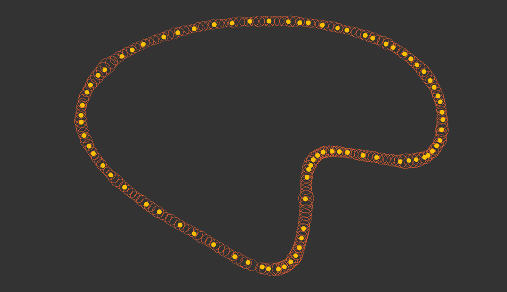
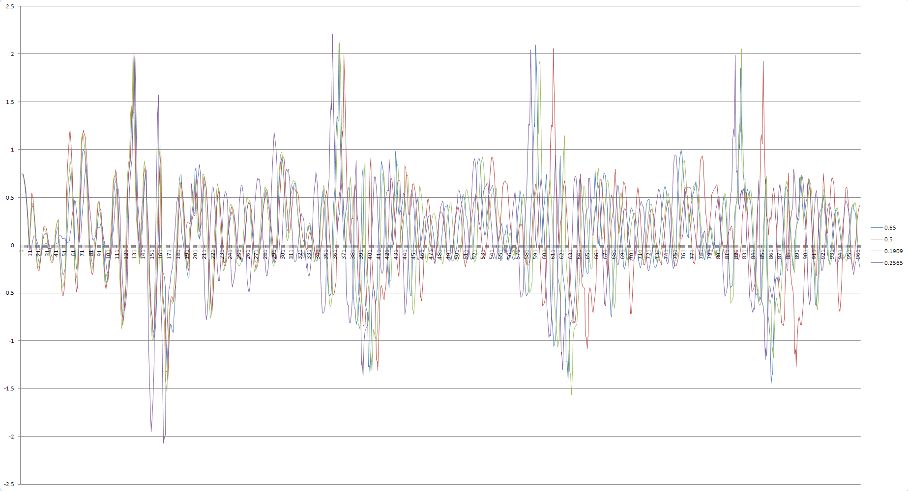
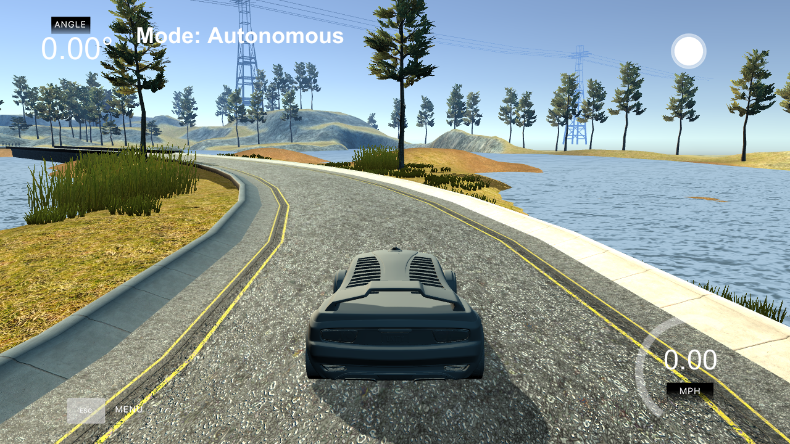

## Model Predictive Control (MPC) Project
Self-Driving Car Engineer Nanodegree Program

---

### Overview
The included source implements a [model predictive controller](https://en.wikipedia.org/wiki/Model_predictive_control) to steer a simulated vehicle around a virtual race track (see map below). The over-arching goal is to safely navigate the track without crossing a yellow side line on the first lap. Secondary goal is to minimize lap time.


### The Model

This implementation employs a simple kinematic model which focuses on position, orientation, and velocity. It ignores tire forces, air resistance, longitudinal & lateral forces, gravity, drag, and mass.

The model's coordinate system origin is located at the vehicle's center of gravity. The x-axis runs in the direction of travel while the y-axis runs perpendicular to the left. The desired trajectory of the vehicle is represented by a 3rd-order polynomial as it fits ideally with the curves of the track.

The <b>state</b> component consists of six variables including position (x,y), orientation (𝜓 psi), velocity (v), cross-track error (cte), and orientation error (epsi). When the vehicle is not "on" the desired trajectory, a non-zero y-intercept occurs. This `cte` value can be read directly from the constant term of the fitted polynomial.

The <b>actuators</b> component consists of two variables including steering angle (𝛿 delta) and accelerator (a). For simplicity, braking and throttle are combined. 

The following <b>update equations</b> are utilized:



where Lf is the distance between the vehicle's steering axle and its center of gravity, and 𝜓des is the desired orientation.

The following cost function is defined to constrain the solution by a non-linear optimizer (aka "solver").

        Cost = cte^2 + psi^2 + e_vel^2 + delta^2 + a^2 + s_delta^2 + s_a^2

where:

        e_vel is the difference to the desired velocity (91mph)
        delta is the steering actuator
        a is the throttle actuator
        s_delta and s_a are sequential actuation differences

Each term in the cost function is weighted. These values were set to those shared in the video walk-through by Aaron Brown and Dominique Luna and empirically increased slightly to stabilize elevated velocity. Additional larger values were attempted which resulted in line-crossings, oscillation, or excursions at the bottom of the lake.

In addition, actuator value ranges are constrained as follows:

        delta (steering)  min= -0.4    max= 0.4  (this translates to 10 degrees)
        a (throttle)      min= -0.02   max= 0.91

### Timestep Length and Elapsed Duration

The ideal timestep length (N) was determined to be 10. The ideal elapsed duration between timesteps (dt) was determined to be 0.11.

Experiments with alternate values: Decreasing `dt` to 0.05 resulted in oscillations and crashes. Increasing `dt` to values higher than 0.11 resulted in smooth driving, but several errors occurred in the turns. Increasing `N` to 20 resulted in longer solver times. Decreasing `N` below 10 produced odd trajectories in a negative y-direction of the polynomial.

Additionally, a 2nd-order polynomial trajectory was tested with less than ideal results.

### Preprocessing and Polynomial Fitting

Six waypoints are transmitted in each telemetry packet. One is located behind the vehicle and five located ahead. These waypoints are provided in global coordinates with the origin at the middle of the lake. They are transformed to vehicle-centered coordinates through translation and rotation: first subtracting the projected (see latency below) global position of the vehicle and then rotating by the vehicle's projected global direction.

A 3rd order <b>polynomial</b> is fitted to the converted waypoints to provide the solver with an estimate of ideal trajectory (i.e. road curvature).

### Model Predictive Control with Latency
Latency can be interpreted as either <b>a)</b> the time between subsequent actuations or <b>b)</b> the duration between command-ready (post-solver) and actuation (i.e. actuator delay). This implementation assumes the latter.

To assist with understanding the role of latency in the model, I visualized the activity components of each frame. In the diagram below (not to scale), the frame at time <i>t</i> is detailed. The incoming telemetry at marker 1 contains the positional data of the vehicle at that exact moment. However, actuation does not truly occur until marker 6.




To handle overall latency, the state of the vehicle must be projected forward (marker 2 and 3) by more than 100 milliseconds prior to calling the solver routine. The solver duration (4) is also a contributing factor to the projection time. Solver durations were measured* to average 29 milliseconds with a standard deviation of 5.6ms if the 10% outliers (on curves) are dropped. One of three timers in the implementation measures solver duration which is averaged across frames. Using [exponential averaging](https://en.wikipedia.org/wiki/Moving_average#Exponential_moving_average), an alpha value of 0.65 produced the lowest CTE, i.e. 65% of the current solver time is factored into the running average. The two other timers measure total latency and frame-to-frame duration. 

In the diagram below, solver latency average time is visualized around the race track. Orange circle diameters correspond to the solver time at that point on the track; yellow dots represent waypoints. On straight sections of the track, the time averages 25ms, whereas on curves (or anticipation thereof), this increases to 50ms and higher. Around the whole track, the actual solver time values range from 15ms to 237ms with an overall average of 31.6 and standard deviation of 10.18.



The sum of the solver average time and the 100ms mandatory actuator delay is used to project the state forward along the current trajectory. An additional 3ms is added to the 100ms to account for measured deviations in sleep duration (perhaps overhead). Position and angle is projected forward by the following equations:

        px = px + latency * v * 0.44704 * cos(psi)
        py = py + latency * v * 0.44704 * sin(psi)
        psi = psi - latency * v * 0.44704 * steering_angle / 2.67

Note: velocity (v) is reported by the simulator in <em>miles per hour</em>. This is converted to <em>meters per second</em> by scaling with 0.44704. `steering_angle` is reported in radians.

The predicted state (along with ideal trajectory, the cost function, and the constraints) are passed to the solver. An upper limit of 250ms of CPU time is imposed.

As an additional trial, a differential shim was inserted following the solver to buffer the projection time. This mechanism acts like a shock absorber such that if the solver time is short, an additional sleep cycle makes up the difference. The solver time projection is the mean plus one standard deviation for a total of 35ms. Initial results are positive, with improved smoothing of solver time latency, however, total CTE did not significantly improve over exponential averaging.

### Methodology
All weights and parameters were ascertained experimentally through iteration and analysis.

To determine an appropriate alpha value for exponential averaging, for each trial value, data was gathered from four consecutive track laps (~965 frames per alpha value) and analyzed with Microsoft Excel (see chart below). Alpha values 0.2565, 0.1909, 0.5, and 0.65 produced respective CTE absolute totals of 377, 382, 380, and 367. (The most stable driving being the lowest CTE). A subsequent increase of the `dt` value from 0.10 to 0.11 resulted in  a decrease of the CTE absolute total to 296. Velocities in all runs were similar.



<b>Duration testing</b>  
The model performed 480 laps (109736 frames) over a non-stop 5-hour period.

### Results
With this controller model in place, the vehicle safely negotiates the corners at 40mph and, after the first lap, reaches speeds of 85 mph. Lap time is about 39 seconds. The model builds speed on straight sections, and slows and/or taps the brakes when significant curvature is detected.

*Hardware testing was performed on a MacBook Air (13-inch mid 2011) with: 1.8 GHz Intel Core i7-2677M 2-core processor, 4 GB 1333 MHz DDR3 memory, Intel HD Graphics 3000 384 MB built-in GPU, MacOS Sierra 10.12.5. Simulator mode: Windowed, screen resolution: 640x480, graphics quality: Fastest.

<b>Video sequence of three laps:</b> [click here (or the image below) for the video](https://vimeo.com/221699363) This live screen recording was made with a Nikon Coolpix S6800 positioned in front of the laptop screen.

[](https://vimeo.com/221699363)

### References
[Model predictive control](https://en.wikipedia.org/wiki/Model_predictive_control)  
[Exponential moving average](https://en.wikipedia.org/wiki/Moving_average#Exponential_moving_average)  
[Polar coordinate system](https://en.wikipedia.org/wiki/Polar_coordinate_system)  
[Tangential angle](https://en.wikipedia.org/wiki/Tangential_angle)  
[Distance from a point to a line](https://en.wikipedia.org/wiki/Distance_from_a_point_to_a_line)  

### Further research
1. Build project on Windows 7 desktop (2.67 GHz 4-core, 12 GB, GTX 1070 GPU).
2. Average solver time can be hash-indexed by waypoint. 
3. A script-controlled operational framework would facilitate automated testing across the matrix of screen resolutions and graphics qualities.
4. Additional differential time-shim study.

---

## Dependencies

* cmake >= 3.5
 * All OSes: [click here for installation instructions](https://cmake.org/install/)
* make >= 4.1
  * Linux: make is installed by default on most Linux distros
  * Mac: [install Xcode command line tools to get make](https://developer.apple.com/xcode/features/)
  * Windows: [Click here for installation instructions](http://gnuwin32.sourceforge.net/packages/make.htm)
* gcc/g++ >= 5.4
  * Linux: gcc / g++ is installed by default on most Linux distros
  * Mac: same deal as make - [install Xcode command line tools]((https://developer.apple.com/xcode/features/)
  * Windows: recommend using [MinGW](http://www.mingw.org/)
* [uWebSockets](https://github.com/uWebSockets/uWebSockets)
  * Run either `install-mac.sh` or `install-ubuntu.sh`.
  * If you install from source, checkout to commit `e94b6e1`, i.e.
    ```
    git clone https://github.com/uWebSockets/uWebSockets 
    cd uWebSockets
    git checkout e94b6e1
    ```
    Some function signatures have changed in v0.14.x. See [this PR](https://github.com/udacity/CarND-MPC-Project/pull/3) for more details.
* Fortran Compiler
  * Mac: `brew install gcc` (might not be required)
  * Linux: `sudo apt-get install gfortran`. Additionall you have also have to install gcc and g++, `sudo apt-get install gcc g++`. Look in [this Dockerfile](https://github.com/udacity/CarND-MPC-Quizzes/blob/master/Dockerfile) for more info.
* [Ipopt](https://projects.coin-or.org/Ipopt)
  * Mac: `brew install ipopt`
  * Linux
    * You will need a version of Ipopt 3.12.1 or higher. The version available through `apt-get` is 3.11.x. If you can get that version to work great but if not there's a script `install_ipopt.sh` that will install Ipopt. You just need to download the source from the Ipopt [releases page](https://www.coin-or.org/download/source/Ipopt/) or the [Github releases](https://github.com/coin-or/Ipopt/releases) page.
    * Then call `install_ipopt.sh` with the source directory as the first argument, ex: `bash install_ipopt.sh Ipopt-3.12.1`. 
  * Windows: TODO. If you can use the Linux subsystem and follow the Linux instructions.
* [CppAD](https://www.coin-or.org/CppAD/)
  * Mac: `brew install cppad`
  * Linux `sudo apt-get install cppad` or equivalent.
  * Windows: TODO. If you can use the Linux subsystem and follow the Linux instructions.
* [Eigen](http://eigen.tuxfamily.org/index.php?title=Main_Page). This is already part of the repo so you shouldn't have to worry about it.
* Simulator. You can download these from the [releases tab](https://github.com/udacity/self-driving-car-sim/releases).
* Not a dependency but read the [DATA.md](./DATA.md) for a description of the data sent back from the simulator.


## Basic Build Instructions


1. Clone this repo.
2. Make a build directory: `mkdir build && cd build`
3. Compile: `cmake .. && make`
4. Run it: `./mpc`.